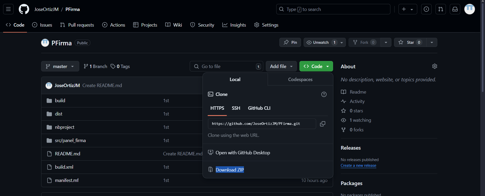
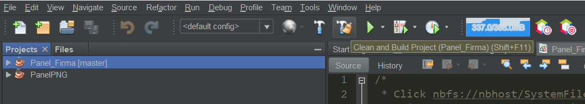
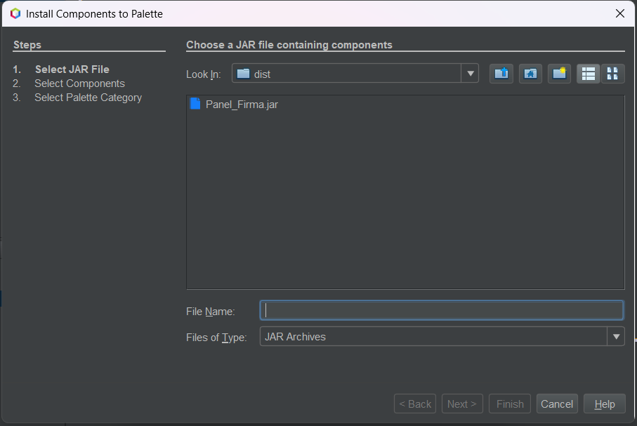
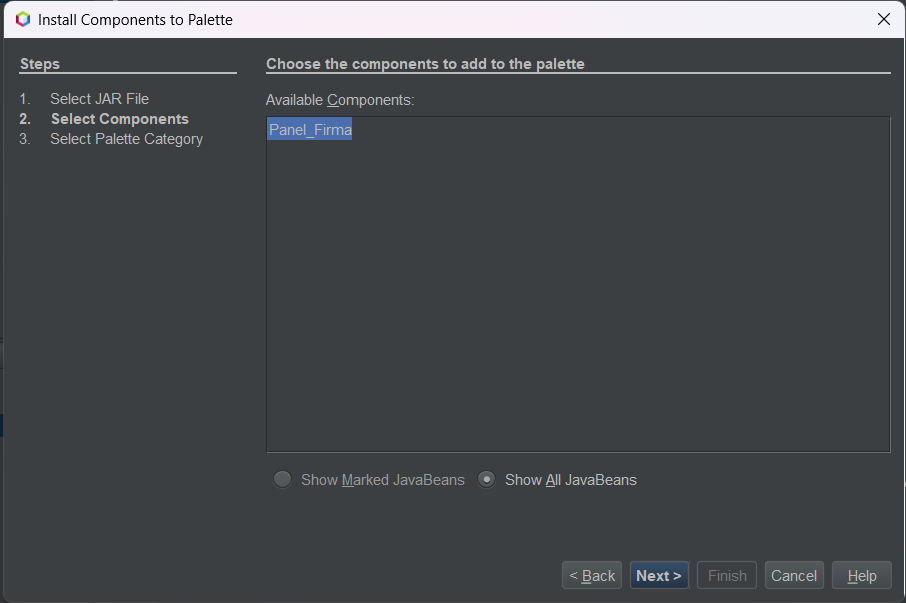
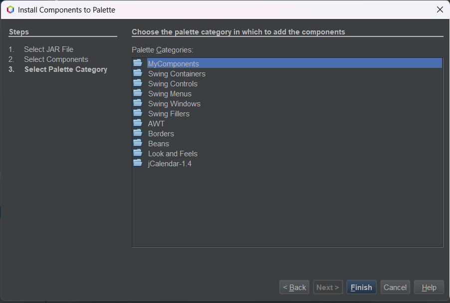

# PanelFirma - Componente Java para Firma Digital

## Descripción
PanelFirma es un componente Java Swing que permite a los usuarios dibujar a mano alzada sobre un panel. Está diseñado para ser fácilmente integrado en aplicaciones Java Swing, pudiendo ser añadido a `JFrame` o `JDialog`. Incluye funcionalidad para limpiar el dibujo realizado.

## Usos
1. **Aplicaciones de Firma Digital**: Integración en sistemas que requieren la captura de firmas digitales, como aplicaciones bancarias, formularios de consentimiento, o sistemas de autenticación.
2. **Herramientas de Dibujo**: Puede ser utilizado en aplicaciones de dibujo simples donde los usuarios pueden dibujar a mano alzada.
3. **Aplicaciones Educativas**: En programas educativos donde se enseñan conceptos básicos de gráficos y eventos de ratón en Java.

## Características
- Permite el dibujo a mano alzada con el ratón.
- Funcionalidad de limpieza del área de dibujo.
- Fácil integración con cualquier componente Swing (`JFrame`, `JDialog`).

## Requisitos
- Java JDK 8 o superior.
- IDE con soporte para Swing (por ejemplo, NetBeans o IntelliJ IDEA).

## API

### PanelFirma

#### Descripción
La clase `PanelFirma` es responsable de capturar eventos de ratón para permitir el dibujo a mano alzada sobre un panel. Utiliza una lista de puntos para almacenar las coordenadas del dibujo.

#### Campos
| Tipo         | Campo  | Descripción                             |
|--------------|--------|-----------------------------------------|
| `List<Point>` | `points` | Lista que almacena los puntos del dibujo. |
| `JButton`    | `clear` | Botón para limpiar el área de dibujo.     |

#### Constructores
| Constructor  | Descripción                                                    |
|--------------|----------------------------------------------------------------|
| `PanelFirma()` | Inicializa el componente, establece el fondo y el borde, y configura los eventos de ratón. |

#### Métodos
| Nombre          | Tipo de Dato que Retorna | Tipo de dato que recibe | Descripción                                                     |
|-----------------|--------------------------|-------------------------|-----------------------------------------------------------------|
| `paintComponent`| `void`                   | `Graphics g`            | Dibuja las líneas basadas en los puntos almacenados.             |
| `clear`         | `void`                   |                         | Limpia la lista de puntos y repinta el panel.                    |

## Instalación
Para utilizar este componente en tu proyecto, sigue estos pasos:
1. Obtener el repositorio: 
   Clona con el siguiente comando
   ```bash
      git clone https://github.com/JoseOrtizJM/PFirma.git
   ```
   Otra opción es descargar `ZIP`.
   
3. Importa el proyecto en tu IDE preferido.
4. Asegúrate de que el proyecto se compila sin errores para crear el `.jar` según la versión de tu Java.

## Uso
1. Compila tu proyecto para crear el archivo `.jar`
   Posteriormente presiona `SHIFT + F11` o da click en el siguiente botón.
    
3. Agrega el componente a tu paleta de componentes.
   Da click derecho en la paleta y selecciona *Palette Manager* y selecciona *Add From Jar*
   Navega hasta la carpeta *dist* del proyecto y selecciona el `.jar`.
   
   
   
4. Ya está listo para usar y arrastrar a tus componentes
5. Prueba ya sea en tu `JFrame` o `JDialog` funciona.
